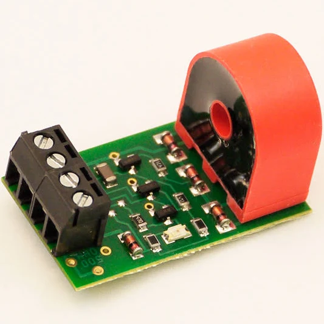
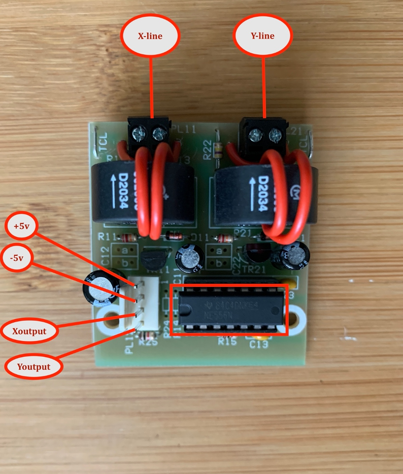

# CtSensor-Block-Occupancy-Detection-Lib

---


# <a href="https://github.com/adarshkumarsingh83/CtSensor-Block-Occupancy-Detection-Lib/archive/production.zip"> Library download link </a>


### YOUTUBE LINK  FOR LIBRARY DETAILS AND DEMO EXAMPLES
[](https://www.youtube.com/watch?v=Qz4yqrIIGEE "CT SENSOR FOR BLOCK DETECTION")

## About the Lib 
```
CtSensor-Block-Detection-Lib is for supporing multiple Ct Sensor Based Block together 
 with less complexcity of the programming 
 this library can work with any type of CT sensor which is capable of detecting small amout of power drawn on dcc system 
 like NCE BD20, MERG CT2-T etc
 we can set the blocks sensors and their pin on arduino 
 and get the status of the sensors by calling methods for block occupancy decection 

```






## Connection Details 
```
pins which are configured on arduino program must have input from the
Ct sensors to those configured input pins 
and use the common gnd from the arduno to those CT sensors which are be read during the program exection 
```


## Steps for using lib

### include the header file

```
#include "CtSensor.h"
```

### define the number of the Ctsensor  we are about to use 
```
#define CT_SENSOR_COUNT 5
```

### define the object for the CtSensor
```
CtSensor ctSensor;
```

### initialize the CtSensor object for using its 
* ctSensor.initCtSensor(CT_SENSOR_COUNT);
```
void setup() {
	............
    ctSensor.initCtSensor(CT_SENSOR_COUNT);
  .............

}

```

### for debug messages a initialize Serial in setup
```

void setup() {
  
  Serial.begin(xxxx); // xxx can be any valid supported number 

  .........
}
```

### Configure the Sensors with sequence and its respective arduino pin 
* ctSensor.setSensorPin(CT_SENSOR_SEQUENCE_NUMBER, CT_SENSOR_ARDUINO_PIN_NUMBER);
```
void setup() {
  .................
  ctSensor.setSensorPin(1, 13);
  ctSensor.setSensorPin(2, 12);
  ctSensor.setSensorPin(3, 11);
  ctSensor.setSensorPin(4, 10);
  ctSensor.setSensorPin(5, 9);
  .................
}
```

### use lib method for getting the Ctsensor status 
* bool state = ctSensor.isSensorActive(CT_SENSOR_SEQUENCE_NUMBER);
	* it will return false when sequence number is invalid 
	* it will return true if sensor is active 
	* it will reurn false when sensor is inactive 
```
void loop() {
  delay(500);

     ...............

    bool state = ctSensor.isSensorActive(CT_SENSOR_SEQUENCE_NUMBER);
	...............
}
```

### ### use lib method for getting the Configured Sensor Pin List 
* tSensor.displayPins(); will print the data on serial monitor 
```
void loop() {
  delay(500);

     ...............

    ctSensor.displayPins();
	...............
}
```


### connection configurations 
```
1.connect the Ctsensor block 1st and 2nd output line to the arduino pin 7 and 6 
2.connect the jumper pin 13 and pin 12 from Arduino to the breadboard for x and y output led
3.connect the resistor to the both jumper end and other side of the resistor will connect to the Led long leg
4.short leg of the led will connect to the common gnd line on the breadboard
5.connect the jumper from Arduino gnd pin to the breadboard common gnd line
6.connect the external +5v power supply to the merg input for vcc and gnd 
7.connect the common gnd from external power supply to the arduno gnd 
8.upload the below code provided later in this section to the Arduino

```

### Complete Example
```

#include "CtSensor.h"

#define CT_SENSOR_COUNT 5
#define X_BLOCK_LED 13
#define Y_BLOCK_LED 12

CtSensor ctSensor;

void setup() {
  Serial.begin(9600);
  ctSensor.initCtSensor(CT_SENSOR_COUNT);
  ctSensor.setSensorPin(1, 7);
  ctSensor.setSensorPin(2, 6);
  pinMode(X_BLOCK_LED, OUTPUT);
  pinMode(Y_BLOCK_LED, OUTPUT);
}

void loop() {
  Serial.println();

  bool xBlockState = ctSensor.isSensorActive(1);
  if (xBlockState) {
    digitalWrite(X_BLOCK_LED, HIGH);
  } else {
    digitalWrite(X_BLOCK_LED, LOW);
  }

  bool yBlockState = ctSensor.isSensorActive(2);
  if (yBlockState) {
    digitalWrite(Y_BLOCK_LED, HIGH);
  } else {
    digitalWrite(Y_BLOCK_LED, LOW);
  }
}

```
